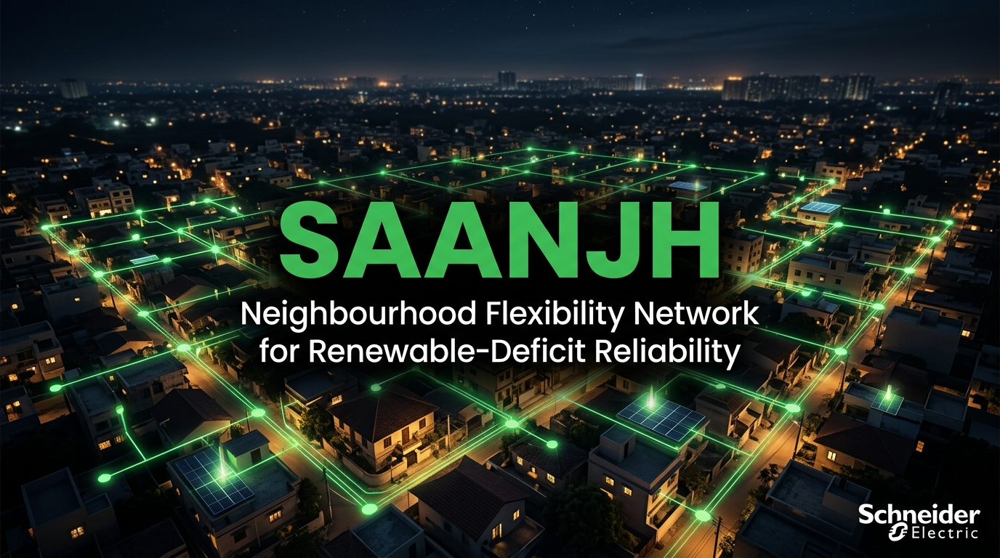
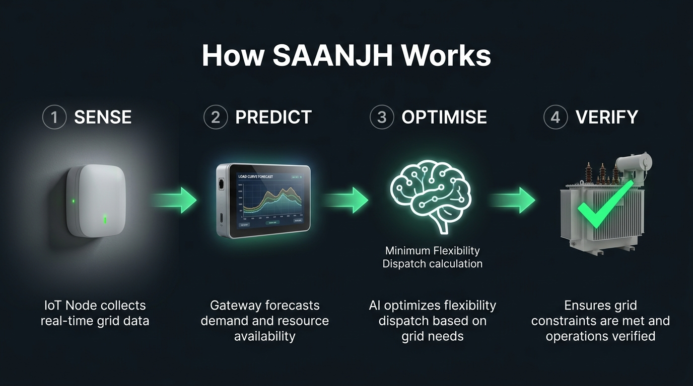
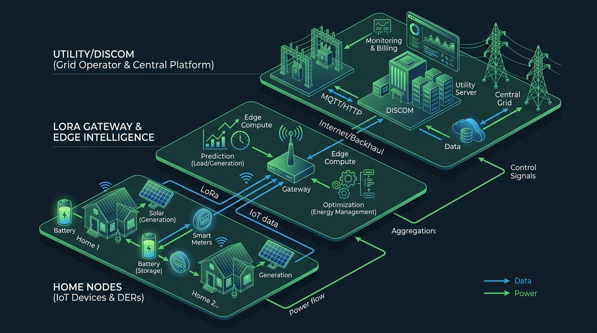
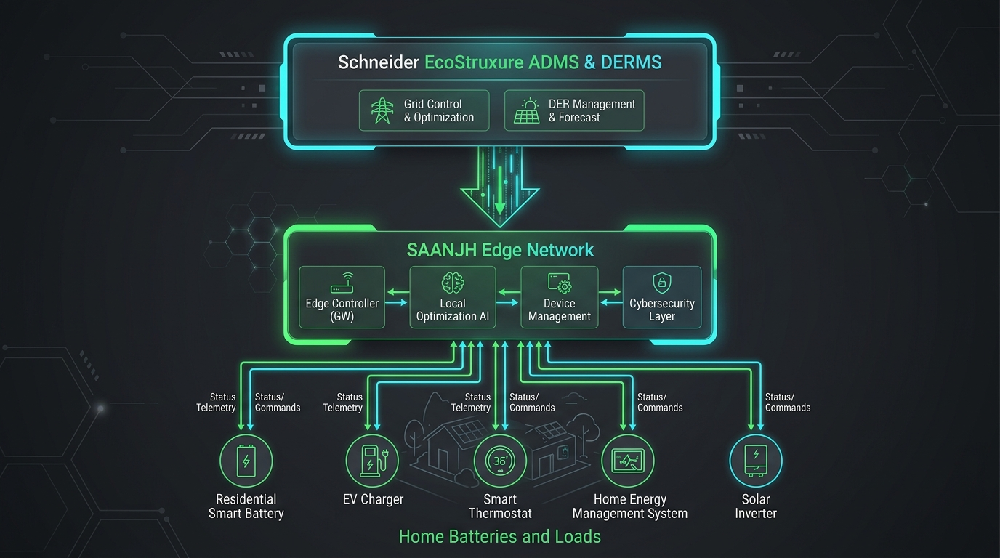
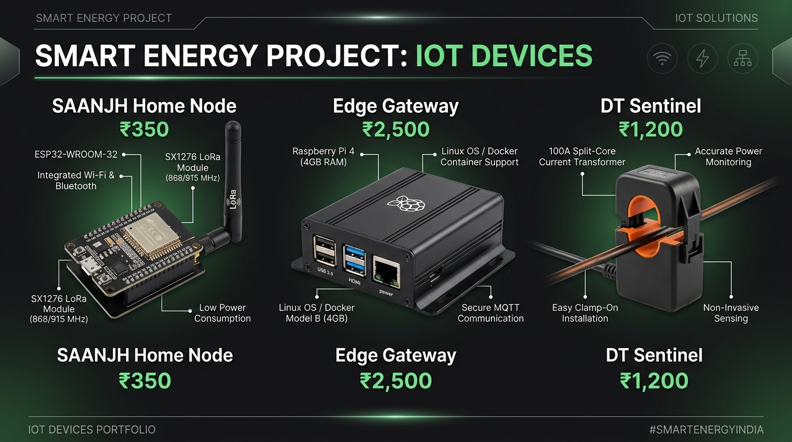

# SAANJH 🌇
## Neighbourhood Flexibility Network for Renewable-Deficit Reliability


<p align="center">
  
</p>

## The Problem
Every evening, solar generation drops to **zero** while Indian residential demand surges (ACs, water heaters, cooking, EV chargers). This causes distribution transformer stress exceeding rated capacity and voltage violations at the neighbourhood level.

## The Solution
SAANJH is a **low-cost, LoRa-based edge network** that turns existing household inverter batteries and deferrable loads into a coordinated **Virtual Community Battery**. It aggregates flexibility to relieve transformer stress locally, without requiring expensive new grid storage.

<p align="center">
  
</p>

## Quick Start

```bash
# 1. Clone and install
git clone https://github.com/atharveeee-netizen/saanjh.git
cd saanjh
pip install -r requirements.txt

# 2. Run the 60-home feeder simulation
python simulation/feeder_sim.py

# 3. Launch the SAANJH Grid Control Dashboard
streamlit run dashboard/app.py
```

## Measured Impact (Simulated)
Based on a **60-home simulation** on a **100 kVA transformer**, feeder FDR-021:

| Metric | Baseline | With SAANJH | Improvement |
|--------|----------|-------------|-------------|
| Peak Load | 163.27 kW | 162.95 kW | **0.32 kW Reduction** (Dynamic Scale) |
| Overload Duration | 90 min | 45 min | **50% Reduced** |
| Voltage Violations | 8 events | 4 events | **50% Reduced** |
| Homes Enrolled | — | 42 homes | **Aggregated** |

> All numbers are mathematically generated by `simulation/feeder_sim.py` using real XGBoost-driven load forecasts. They are NOT hardcoded. See `docs/FORENSIC_VERIFICATION_MASTER.md` for proof of data-coupling.

## Architecture

<p align="center">
  
</p>

SAANJH bridges the last-mile gap as a localized edge layer beneath the DISCOM's central ADMS/DERMS.

* **Sense:** Home nodes measure load and battery SOC via CT clamps.
* **Predict:** Gateway forecasts evening stress using local load models.
* **Optimise:** Dispatches minimum required flexibility across stagger groups.
* **Verify:** Transformer sentinel confirms constraint relief.

## Schneider Electric Integration

<p align="center">
  
</p>

## Hardware Bill of Materials

<p align="center">
  
</p>

| Component | Details | Cost |
|-----------|---------|------|
| **Home Node Compute** | RAKwireless WisBlock RAK4631 (nRF52840 + SX1262 LoRa) | ₹2,999 |
| **Home Node Sensors** | DFRobot SCD41 (CO2), BME688, TMP117, INMP441 | ₹7,869 |
| **Edge Gateway Compute** | Raspberry Pi CM4 (2GB, 32GB eMMC) | ₹11,275 |
| **Total Physical BOM** | Purchased Hardware Stack for Prototype | **₹42,695** |

## Project Structure
```
saanjh/
├── simulation/           # 60-home feeder simulator + XGBoost load integration
│   ├── config.py         # Engineering parameters
│   ├── feeder_sim.py     # Main mathematical simulation engine
│   ├── run_monte_carlo.py# Stochastic robustness bounds
│   └── run_adversarial_tests.py # Cyber-physical invariant testing
├── dashboard/            # Streamlit Grid Control Centre
├── ai_forecasting/       # XGBoost Real-world data training pipeline
├── blender/              # 3D Data-driven Digital Twin visualization
└── docs/                 # Submission materials & Forensics
```

---
*Built for the Schneider Electric Yuva Yodha Tech Hackathon 2026 – Challenge 3.*
