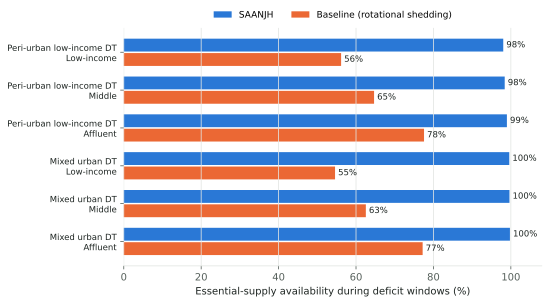
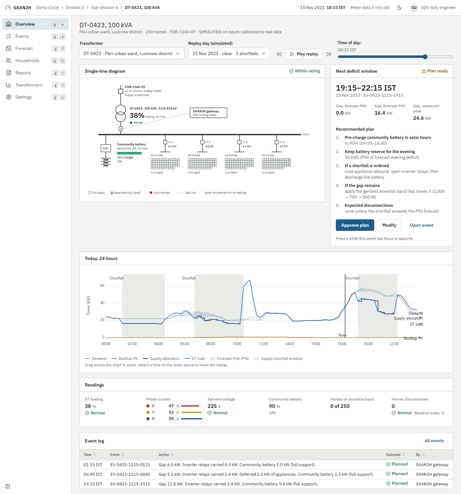

# SAANJH

When a state runs short of power in the evening, DISCOMs switch off whole feeders in
rotation and every home on them loses everything. SAANJH keeps every home's essentials
(lights, fans, fridge, phone charging) on instead. It caps heavy loads through the
smart meters DISCOMs are already installing, shares a second-life community battery at
the distribution transformer, borrows a little from homes that own inverters, and plans
each evening with a probabilistic forecast. Built for the Schneider Electric Yuva Yodha
2026 hackathon, track "Grid Reliability & Renewable Intermittency".

<!-- results:headline:start -->
On the simulated peri-urban low-income DT (250 homes), homes kept their essential supply during 98% of supply-shortfall time with SAANJH, against 59% under today's rotational load shedding, and full disconnection fell from 240 to 10.8 hours per home per year (mean of 30 Monte Carlo runs). On the simulated mixed urban DT (200 homes), homes kept their essential supply during 100% of supply-shortfall time with SAANJH, against 62% under today's rotational load shedding, and full disconnection fell from 78 to 0.7 hours per home per year (mean of 30 Monte Carlo runs). Most of the gain comes from the shared community battery: without it, essential-supply availability is 76% on the peri-urban low-income DT and 82% on the mixed urban DT.
<!-- results:headline:end -->

**Interactive console:** see the link in [docs/WRITEUP.md](docs/WRITEUP.md#9-design-artefacts) (operator console, local operator app, household messages, service blueprint).

## Results

<!-- results:readme_results:start -->
*SIMULATED on inputs calibrated to real data. Mean of 30 Monte Carlo runs over one year (Lucknow 2023 weather). Full tables, ranges and sensitivity: [docs/WRITEUP.md](docs/WRITEUP.md).*

| Metric | Peri-urban low-income DT: baseline → SAANJH | Mixed urban DT: baseline → SAANJH |
|---|---:|---:|
| Essential-supply availability in deficit windows | 59% → 98% | 62% → 100% |
| Outage hours per home per year | 240.3 → 10.8 | 78.0 → 0.7 |
| Energy not served (kWh/year) | 11,457 → 527 | 3,019 → 36 |
| Hours on essential band per home per year | 0.0 → 1.2 | 0.0 → 0.2 |
| Net cost per home per month (DISCOM-owned) | Rs 103 | Rs 138 |
| Cost per household-hour of essential supply preserved | Rs 9 | Rs 35 |
<!-- results:readme_results:end -->





## Quick start

```bash
pip install -r requirements.txt          # Python 3.11
pytest                                   # physics, calibration, economics and consistency tests
cd ui && npm install && npm run dev      # operator console at http://localhost:5173
```

To regenerate everything from scratch (about an hour on a 32-core machine):

```bash
python simulation/run_year.py            # year-long Monte Carlo + sensitivity
python ai_forecasting/evaluate.py        # forecasts (Chronos-2 on CPU) and decision value
python simulation/economics_engine.py    # unit economics and ownership models
python scripts/make_figures.py && python scripts/make_diagrams.py
python backend/export.py                 # replay data for the API and the UI
python scripts/render_results.py         # fills every results table in the docs
uvicorn backend.main:app --port 8000     # optional API (the UI also runs on the static bundle)
```

## Repository map

| Path | What it is |
|---|---|
| `docs/WRITEUP.md` | The submission write-up |
| `docs/PROJECT_BRIEF.md` | Facts, sources and ground rules every change follows |
| `docs/DATA_SOURCES.md` | Every dataset, its licence and its REAL / CALIBRATED / SIMULATED label |
| `docs/OWNERSHIP_MODEL.md` | Ownership, O&M and unit economics |
| `docs/SERVICE_BLUEPRINT.md` | Service blueprint, enrolment to complaints |
| `docs/architecture/` | Architecture, event sequence, failure modes, data model, money flows (Mermaid + SVG) |
| `docs/REVIEW_FINDINGS.md` | Hostile-reviewer pass |
| `simulation/` | Household fleet, mechanisms, dispatcher, year-long engine, metrics, economics |
| `ai_forecasting/` | Day-ahead probabilistic forecasting and its evaluation |
| `data/` | Download and processing scripts; processed NASA POWER weather |
| `config/` | All parameters with source or ASSUMPTION labels |
| `backend/` | FastAPI replay service and the data exporter |
| `ui/` | React operator console, field app, household messages, design system |
| `tests/` | pytest suite |
| `archive/` | Earlier Blender renders, demo videos and video scripts (not part of the submission) |

## Data sources

NASA POWER (weather, real data), Prayas eMARC (household load calibration), Prayas ESMI
(outage calibration) and the UCI household dataset (non-Indian forecasting benchmark
only). Details and limitations: [docs/DATA_SOURCES.md](docs/DATA_SOURCES.md).

## Licence

The authors have not yet chosen a licence for this code; add one before making the
repository public. Third-party data keeps its own licence (see `docs/DATA_SOURCES.md`).
