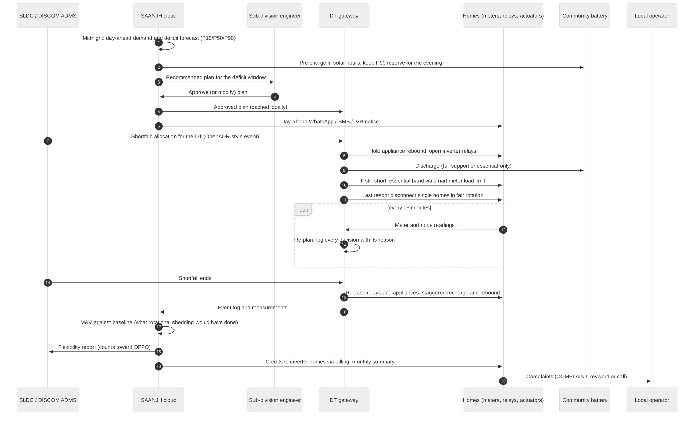
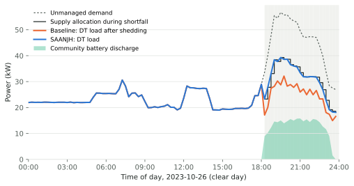
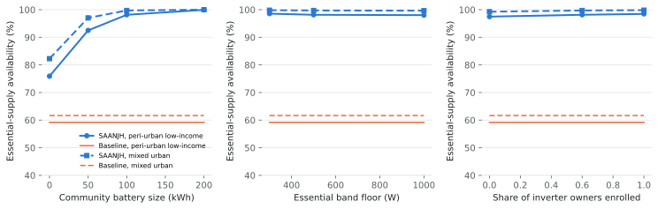

# SAANJH: essential supply for everyone on the transformer

Schneider Electric Yuva Yodha 2026 · Track: Grid Reliability & Renewable Intermittency

<!-- results:headline:start -->
On the simulated peri-urban low-income DT (250 homes), homes kept their essential supply during 98% of supply-shortfall time with SAANJH, against 59% under today's rotational load shedding, and full disconnection fell from 240 to 10.8 hours per home per year (mean of 30 Monte Carlo runs). On the simulated mixed urban DT (200 homes), homes kept their essential supply during 100% of supply-shortfall time with SAANJH, against 62% under today's rotational load shedding, and full disconnection fell from 78 to 0.7 hours per home per year (mean of 30 Monte Carlo runs). Most of the gain comes from the shared community battery: without it, essential-supply availability is 76% on the peri-urban low-income DT and 82% on the mixed urban DT.
<!-- results:headline:end -->

Every number in this document is produced by code in this repository and rendered from
`simulation/results/results.json`. Each input is labelled REAL DATA, CALIBRATED TO REAL
DATA or SIMULATED (see `docs/DATA_SOURCES.md`). No hardware was built for this
submission.

## 1. The problem

As India adds solar, the hard hour moves to the evening. Solar output falls to zero
between about 17:00 and 18:30 while household demand climbs to its peak around 21:00.
On hot, cloudy or monsoon days the gap between what the grid can supply and what homes
want widens. When a state is short, the grid operator orders DISCOMs to cut load, and
DISCOMs do it the only way their networks allow: they switch off whole feeders in
rotation.

Rotational shedding is blunt. To cut 20% of a transformer's load, a quarter or half of
its homes lose everything, including the lights, fans, fridge and phone charging that
make an evening liveable. Homes that can afford inverters ride through; most low-income
homes cannot. Prayas (Energy Group)'s Electricity Supply Monitoring Initiative measured
this at consumer premises across Uttar Pradesh between 2016 and 2019. Evening outages
(17:00–23:00) averaged about 12 minutes a day in Lucknow, 53 minutes in other municipal
areas and about 90 minutes in rural areas. An IIT Madras six-state study found only 4–5%
of households own inverters, concentrated among affluent homes.

## 2. What SAANJH does

SAANJH is an essential-supply layer for a distribution transformer (DT). During a
shortfall, every home on the DT keeps its essentials on, instead of a whole feeder
going dark. It combines three mechanisms with a forecast:

1. **Essential band.** The smart meters DISCOMs are installing under RDSS can limit a
   home's load rather than disconnect it. SAANJH caps homes that draw above an essential
   band (the gentlest of 1,000, 750 or 500 W that closes the gap). Homes flagged as
   critical (a medical device, a shop fridge) keep a higher band. A short grace period
   stops fridge and fan start-up currents from tripping the meter.
2. **Community battery.** A second-life EV battery pack at the DT, charged in solar
   hours, carries the gap for everyone, including homes with no storage of their own.
3. **Household flexibility, where it exists.** Inverter homes can lend part of their
   battery. A normally-closed relay on the inverter's mains input puts its backed-up
   circuits on battery, never below 70% charge, so the family's own backup is untouched.
   Geysers, pumps and ACs can be deferred where a smart plug or contactor is fitted.
   Deferred energy returns later, and the model counts it.
4. **Probabilistic forecast.** A day-ahead forecast of the DT's demand and deficit
   (P10/P50/P90) tells the operator how much battery energy to keep back for the evening.

**Dispatch policy** (`simulation/dispatcher.py`), applied every 15 minutes:

1. Close the gap with flexibility that costs no one their essentials: hold appliance
   rebound, open inverter relays, defer appliances, discharge the community battery (if
   it has enough energy for the whole expected event).
2. If still short, apply the gentlest essential band that closes the gap.
3. If still short, use battery energy held back for exactly this case.
4. Only then disconnect single homes through their smart meters, rotating fairly, with
   critical homes last.

Every decision is logged with its reason, and the operator console shows it.

## 3. Why it suits Indian distribution grids

- **It builds on what DISCOMs are already installing.** About 5.53 crore consumer smart
  meters and 18.5 lakh DT meters were installed under RDSS by 30 June 2026. The band
  needs no new hardware in most homes.
- **It earns regulatory credit.** Maharashtra, Karnataka and Rajasthan now place
  demand-flexibility obligations on DISCOMs. Flexibility delivered at the DT counts
  toward them, and Rajasthan's draft rules open an aggregator route and require open
  protocols (OpenADR, IEEE 2030.5).
- **It runs locally.** The gateway at the DT keeps running the approved plan if the
  backhaul fails, and every actuator fails toward normal supply.
- **It reaches people without apps.** Households hear from SAANJH by WhatsApp, SMS or a
  voice call in Hindi, Marathi or English, and a paid local operator from the community
  handles enrolment and questions.
- **It works with Time-of-Day tariffs.** Charging the battery in solar hours is cheapest
  under the ToD tariffs that come with smart meters.
- **It has precedent.** Eskom limits smart-meter customers to 10 A before resorting to
  load shedding, and recent work from Northwestern University (with NBER) argues that
  power limits beat rolling blackouts on welfare.

## 4. Key assumptions

| Assumption | Value | Label |
|---|---|---|
| Household load shapes | Calibrated so a typical home draws 100–150 W at night and 200–250 W at 21:00 outside summer, AC homes about 600 W and water-heater homes about 500 W at peak | CALIBRATED TO REAL DATA (Prayas eMARC) |
| Weather and PV | Lucknow, 2023, hourly irradiance and temperature | REAL DATA (NASA POWER) |
| Baseline outages | Shortfall outages = 50% of ESMI evening outage minutes for the location type | CALIBRATED TO REAL DATA; the 50% is an ASSUMPTION varied 30–70% |
| Shortfall depth | 15–45% of load during an event | ASSUMPTION (25–60% tested) |
| Inverter ownership | Low-income 2%, middle 20%, affluent 50%; 60% of owners enrol | ASSUMPTION, consistent with the IIT Madras finding |
| Community battery | 100 kWh / 40 kW second-life LFP, 85% round-trip, 10–90% usable | ASSUMPTION (0–200 kWh tested) |
| Inverter battery | 1.8 kWh lead-acid, 80% round-trip, reserve 70% | ASSUMPTION |
| Baseline policy | Rotational shedding of whole LT feeders (finer than common 11 kV feeder shedding, so not a strawman) | SIMULATED |

## 5. Architecture

The gateway at the DT runs dispatch locally; the cloud forecasts, plans, verifies and
settles. The diagrams of one deficit event, the failure modes, the data model and the
money flows are in `docs/architecture/`.

## 6. Reliability results against a defined baseline

**Baseline:** what DISCOMs do today, rotational shedding of whole LT feeders until the
DT's demand fits its allocation. Homes with inverters fall back on their own batteries.
**Headline metric:** essential-supply availability during deficit windows, the share of
shortfall time in which a home's essentials were powered (by the grid within its band,
or by its own inverter). Both policies see identical homes, appliance use, weather and
shortfalls in each run.

<!-- results:annual:start -->
*SIMULATED on inputs CALIBRATED TO REAL DATA (see docs/DATA_SOURCES.md). Mean over 30 Monte Carlo seeds, 365 days at 15-minute resolution, weather for Lucknow 2023; P10–P90 across seeds in brackets.*

**Peri-urban low-income DT**: 250 homes on a 100 kVA DT (segment mix Low-income 70%, Middle 25%, Affluent 5%). Baseline calibrated to ESMI 'other municipal' locations: 27 shortfall outage minutes per evening (target 26.5), 39 per day (target 45.0).

| Metric | Baseline | SAANJH |
|---|---:|---:|
| Essential-supply availability in deficit windows | 59% (58%–60%) | 98% (97%–99%) |
| Outage hours per home per year (full disconnection) | 240.3 (213.5–269.7) | 10.8 (6.8–15.0) |
| Hours on essential band per home per year | 0.0 (0.0–0.0) | 1.2 (0.7–1.7) |
| Energy not served (kWh/year) | 11,457 (10,146–12,996) | 527 (327–763) |
| Energy curtailed above the band (kWh/year) | 0 (0–0) | 37 (22–52) |
| DT peak loading | 87% | 93% |
| Fairness of outage hours across homes (Gini, 0 = equal) | 0.00 | 0.02 |

| Essential-supply availability by segment | Baseline | SAANJH |
|---|---:|---:|
| Low-income | 56% | 98% |
| Middle | 65% | 98% |
| Affluent | 78% | 99% |

Household-hours of essential supply preserved per year: 52,164. Flexibility delivered per year: 1.2 MWh of demand flexibility (inverter relays 1.2 MWh, essential band 0.04 MWh, appliances 0.02 MWh) plus 7.0 MWh from the community battery (76 equivalent full cycles). Extra cycles on household inverter batteries (average over homes with an inverter): 31.8 per year.

**Mixed urban DT**: 200 homes on a 100 kVA DT (segment mix Low-income 40%, Middle 45%, Affluent 15%). Baseline calibrated to ESMI 'megacity' locations: 6 shortfall outage minutes per evening (target 6.0), 11 per day (target 10.5).

| Metric | Baseline | SAANJH |
|---|---:|---:|
| Essential-supply availability in deficit windows | 62% (60%–63%) | 100% (99%–100%) |
| Outage hours per home per year (full disconnection) | 78.0 (62.7–89.9) | 0.7 (0.1–1.4) |
| Hours on essential band per home per year | 0.0 (0.0–0.0) | 0.2 (0.0–0.5) |
| Energy not served (kWh/year) | 3,019 (2,498–3,487) | 36 (8–70) |
| Energy curtailed above the band (kWh/year) | 0 (0–0) | 7 (1–14) |
| DT peak loading | 83% | 92% |
| Fairness of outage hours across homes (Gini, 0 = equal) | 0.00 | 0.17 |

| Essential-supply availability by segment | Baseline | SAANJH |
|---|---:|---:|
| Low-income | 55% | 100% |
| Middle | 63% | 100% |
| Affluent | 77% | 100% |

Household-hours of essential supply preserved per year: 12,814. Flexibility delivered per year: 0.6 MWh of demand flexibility (inverter relays 0.5 MWh, essential band 0.01 MWh, appliances 0.03 MWh) plus 1.7 MWh from the community battery (19 equivalent full cycles). Extra cycles on household inverter batteries (average over homes with an inverter): 9.7 per year.
<!-- results:annual:end -->

### Sensitivity

<!-- results:sensitivity:start -->
*SIMULATED. Each row changes one input; mean of 10 seeds. Availability = essential-supply availability in deficit windows.*

| Input | Value | Peri-urban low-income DT: baseline / SAANJH availability, SAANJH outage h | Mixed urban DT: baseline / SAANJH availability, SAANJH outage h |
|---|---|---:|---:|
| Essential band floor (W) | 300 | 59% / 99%, 8.3 h | 62% / 100%, 0.4 h |
| Essential band floor (W) | 500 | 59% / 98%, 10.6 h | 62% / 100%, 0.6 h |
| Essential band floor (W) | 1000 | 59% / 98%, 11.4 h | 62% / 100%, 0.7 h |
| Community battery (kWh) | 0 | 59% / 76%, 138.8 h | 62% / 82%, 33.2 h |
| Community battery (kWh) | 50 | 59% / 93%, 43.3 h | 62% / 97%, 5.6 h |
| Community battery (kWh) | 100 | 59% / 98%, 10.6 h | 62% / 100%, 0.6 h |
| Community battery (kWh) | 200 | 59% / 100%, 0.4 h | 62% / 100%, 0.0 h |
| Inverter owners enrolled | 0.0 | 59% / 97%, 14.5 h | 62% / 99%, 1.5 h |
| Inverter owners enrolled | 0.6 | 59% / 98%, 10.6 h | 62% / 100%, 0.6 h |
| Inverter owners enrolled | 1.0 | 59% / 98%, 8.8 h | 62% / 100%, 0.3 h |
| Segment mix | base | 59% / 98%, 10.6 h | 62% / 100%, 0.6 h |
| Segment mix | more affluent | 60% / 98%, 12.3 h | 64% / 99%, 1.1 h |
| Share of outages caused by shortfall | 0.3 | 60% / 99%, 3.7 h | 61% / 100%, 0.3 h |
| Share of outages caused by shortfall | 0.5 | 59% / 98%, 10.6 h | 62% / 100%, 0.6 h |
| Share of outages caused by shortfall | 0.7 | 59% / 97%, 25.6 h | 62% / 100%, 0.8 h |
| Shortfall depth | 15-45% | 59% / 98%, 10.6 h | 62% / 100%, 0.6 h |
| Shortfall depth | 25-60% | 46% / 94%, 37.0 h | 50% / 98%, 4.1 h |
<!-- results:sensitivity:end -->

What the sensitivity runs show:

- The community battery does most of the work. On a low-income DT, most homes already
  draw less than 500 W in the evening, so the essential band has little to cut. Without
  storage, SAANJH still beats rotational shedding, because it disconnects single homes
  rather than whole feeders. It does not reach near-full essential supply.
- Inverter relays help, but only a little, because few homes have inverters.
- Deeper shortfalls hurt both policies; SAANJH degrades more gracefully.

## 7. Forecasting and its decision value

<!-- results:forecast_accuracy:start -->
*Forecasts of SIMULATED DT demand on REAL weather (see ai_forecasting/README.md). Day-ahead, 96 blocks, issued at midnight; test days 28–364 of seed 0. MASE below 1 beats yesterday's profile. Chronos: amazon/chronos-2 (zero-shot).*

**Peri-urban low-income DT**

| Model | MASE | MAE (kW) | Pinball loss (kW) | P10–P90 coverage |
|---|---:|---:|---:|---:|
| Seasonal naive | 1.02 | 1.2 | 0.48 | 53% |
| Weekly naive | 1.91 | 2.2 | 1.11 | – |
| XGBoost quantile | 1.55 | 1.8 | 0.65 | 69% |
| Chronos-2 (zero-shot) | 0.99 | 1.2 | 0.42 | 68% |

| Evening deficit-energy forecast from | P10–P90 coverage | Days above P90 | Mean P90 (kWh) | Mean realised (kWh) |
|---|---:|---:|---:|---:|
| Seasonal naive | 88% | 12% | 60.0 | 22.9 |
| XGBoost quantile | 84% | 16% | 53.8 | 22.9 |
| Chronos-2 (zero-shot) | 87% | 13% | 57.8 | 22.9 |

**Mixed urban DT**

| Model | MASE | MAE (kW) | Pinball loss (kW) | P10–P90 coverage |
|---|---:|---:|---:|---:|
| Seasonal naive | 1.01 | 1.6 | 0.60 | 53% |
| Weekly naive | 1.60 | 2.5 | 1.26 | – |
| XGBoost quantile | 1.38 | 2.2 | 0.74 | 69% |
| Chronos-2 (zero-shot) | 0.83 | 1.3 | 0.45 | 69% |

| Evening deficit-energy forecast from | P10–P90 coverage | Days above P90 | Mean P90 (kWh) | Mean realised (kWh) |
|---|---:|---:|---:|---:|
| Seasonal naive | 91% | 9% | 12.6 | 4.7 |
| XGBoost quantile | 90% | 10% | 9.5 | 4.7 |
| Chronos-2 (zero-shot) | 91% | 9% | 10.9 | 4.7 |
<!-- results:forecast_accuracy:end -->

The forecast is worth what it changes. The decision it drives is how much battery
energy to keep back for deficits while using the rest to shave the evening peak, the
dearest Time-of-Day block:

<!-- results:forecast_decision:start -->
*SIMULATED. Year-long SAANJH runs, mean of 3 seeds. The community battery shaves the 18:00–22:00 peak but keeps a deficit reserve set by each policy.*

| Reserve policy | Peri-urban low-income DT: availability / outage h / peak shaved (MWh) | Mixed urban DT: availability / outage h / peak shaved (MWh) |
|---|---:|---:|
| full reserve (no peak shaving) | 98.6% / 8.3 h / 0.0 | 99.7% / 0.7 h / 0.0 |
| fixed 25% reserve (no forecast) | 94.3% / 33.5 h / 15.8 | 97.2% / 5.5 h / 18.2 |
| fixed 50% reserve (no forecast) | 96.9% / 18.4 h / 9.6 | 98.8% / 2.3 h / 11.3 |
| fixed 75% reserve (no forecast) | 98.1% / 11.2 h / 3.7 | 99.4% / 1.1 h / 4.5 |
| Seasonal naive P90 reserve | 98.4% / 9.6 h / 3.9 | 96.0% / 7.7 h / 19.3 |
| Seasonal naive P97 reserve | 98.6% / 8.4 h / 1.1 | 99.1% / 1.7 h / 9.1 |
| Seasonal naive P99.5 reserve | 98.6% / 8.3 h / 0.2 | 99.6% / 0.7 h / 2.2 |
| XGBoost quantile P90 reserve | 98.1% / 11.1 h / 5.2 | 95.4% / 9.0 h / 20.4 |
| XGBoost quantile P97 reserve | 98.5% / 8.6 h / 1.7 | 98.8% / 2.3 h / 10.6 |
| XGBoost quantile P99.5 reserve | 98.6% / 8.4 h / 0.4 | 99.6% / 0.7 h / 3.0 |
| Chronos-2 (zero-shot) P90 reserve | 98.3% / 9.8 h / 4.4 | 95.6% / 8.4 h / 19.8 |
| Chronos-2 (zero-shot) P97 reserve | 98.6% / 8.4 h / 1.3 | 99.1% / 1.7 h / 9.7 |
| Chronos-2 (zero-shot) P99.5 reserve | 98.6% / 8.3 h / 0.3 | 99.6% / 0.8 h / 2.5 |
<!-- results:forecast_decision:end -->

Details and limitations: `ai_forecasting/README.md`.

## 8. Ownership, operations and unit economics

<!-- results:economics:start -->
*Computed by simulation/economics_engine.py from config/economics.yaml (base case) and the year-long results. Per DT, DISCOM-owned model.*

| | Peri-urban low-income DT | Mixed urban DT |
|---|---:|---:|
| Up-front cost (community battery + edge) | Rs 17,24,232 | Rs 17,50,070 |
| …of which community battery | Rs 16,10,000 | Rs 16,10,000 |
| Annual DISCOM benefits | Rs 1,67,043 | Rs 1,15,386 |
| Annual operating cost | Rs 1,55,271 | Rs 1,21,936 |
| DISCOM NPV over 10 years | −Rs 24,02,979 | −Rs 25,41,400 |
| Simple payback | 146.5 years | does not pay back |
| Up-front cost to a low-income household | Rs 0 | Rs 0 |
| Net cost per home per month if spread across the DT | Rs 103 | Rs 138 |
| Cost per household-hour of essential supply preserved | Rs 9 | Rs 35 |
| Same hour from a home inverter the family buys itself | Rs 21 | Rs 66 |
| Up-front cost per kW of flexibility (utility BESS benchmark) | Rs 43,106 (Rs 40,000) | Rs 43,752 (Rs 40,000) |
| Payment to an inverter home per kWh lent (wear + charging loss) | Rs 20.6 (Rs 15.5 + Rs 1.6) | Rs 20.6 (Rs 15.5 + Rs 1.6) |
| Societal value of lost load avoided per year (not DISCOM cash) | Rs 3,79,545 | Rs 1,17,775 |

Peri-urban low-income DT: if the community battery also shaves the evening peak, using the reserve policy that shaves most while keeping availability within 0.5 points of a fully reserved battery (XGBoost quantile P90 reserve), the DISCOM NPV becomes −Rs 22,16,284 and the net cost per home Rs 93 per month.

Mixed urban DT: if the community battery also shaves the evening peak, using the reserve policy that shaves most while keeping availability within 0.5 points of a fully reserved battery (fixed 75% reserve (no forecast)), the DISCOM NPV becomes −Rs 23,77,319 and the net cost per home Rs 127 per month.
<!-- results:economics:end -->

Low-income households pay nothing up front and nothing monthly. Homes that lend an
inverter battery are paid more per kWh than the battery wear and charging losses cost
them. The full comparison of DISCOM-owned, community-owned and aggregator-owned models,
with O&M responsibilities and the inputs that move the numbers most, is in
`docs/OWNERSHIP_MODEL.md`. We recommend DISCOM-owned assets operated by a paid local
operator from the community: it has the lowest cost of capital, and the flexibility
credit stays with the party that carries the obligation.

## 9. Design artefacts

The operator console, local operator app, household messages and service blueprint are
in `ui/` and published as an interactive page. They include:

- the DT overview with a live single-line diagram, forecast and plan approval;
- the event view with its decision log and measurement and verification against the
  baseline;
- the household table;
- the monthly reliability and flexibility report;
- the local operator's field app in English, Hindi and Marathi;
- the WhatsApp, SMS and voice flows with SMS length checks;
- the household status page;
- the service blueprint (`docs/SERVICE_BLUEPRINT.md`).

## 10. How this differs from existing Indian pilots

| | JVVNL Jaipur ADR | BSES Yamuna ADR | Peer-to-peer trading (India Energy Stack) | SAANJH |
|---|---|---|---|---|
| Who takes part | ~2,000 AC homes (~1 MW expected) | Participating homes | Prosumers with rooftop PV | Every home on a DT |
| What changes | AC setpoint +1 °C | Automated load control (17–20% peak cut) | Energy traded between homes | Essential supply kept on during shortfalls |
| Who benefits | DISCOM peak | DISCOM peak | Prosumers | Homes that would otherwise be shed, most of them low-income |

SAANJH complements these programmes. AC setpoint control is one of its appliance-flex
options, and its DT-level reports could feed the same flexibility portfolio.

## 11. Pilot plan

One DT for three months, with a cooperating sub-division:

1. **Month 1:** enable load limiting on the DT's smart meters; install the gateway and
   a community battery; enrol households with consent; fit relays in the few inverter
   homes that want them.
2. **Months 2–3:** run SAANJH during real shortfall orders. A neighbouring DT under
   normal rotational shedding serves as the control.
3. **What we measure:** outage minutes and essential-supply minutes per home (meter
   data, plus ESMI-style voltage monitors at a sample of homes); battery cycles and
   temperature; complaints; household satisfaction by segment.
4. **What we need from the DISCOM:** head-end access for load limits, the DT meter
   feed, shortfall schedules in advance, a site for the battery, and a named
   sub-division engineer.

## 12. Limitations and what we would validate next

- **Simulated demand:** results come from a calibrated simulation, not metered DT data.
  The eMARC calibration fits averages, not the full spread between homes.
- **Baseline shortfalls:** these come from published ESMI averages and an assumed share
  of outages caused by supply shortfall. The minute-level ESMI data, downloadable after
  a form, would let us calibrate each location.
- **Shortfall forecast:** the forecaster shares the statistical shortfall model with the
  simulation, so its deficit forecast is well matched by construction.
- **Feeder model:** the power-flow model is a lumped, balanced feeder, and phase
  imbalance is not modelled.
- **Not modelled:** meter inrush handling is modelled only as a trip delay, and
  household behaviour under the band (switching off heavy appliances) is assumed.
- **Economics:** the economics use assumed prices with ranges. Second-life battery cost
  and degradation are the largest uncertainties.

## 13. References

- Prayas (Energy Group), electricity load patterns (eMARC): https://energy.prayaspune.org/electricity-load-patterns
- Prayas (Energy Group), ESMI in Uttar Pradesh: https://energy.prayaspune.org/our-work/article-and-blog/esmi-in-uttar-pradesh
- ESMI minute-wise voltage data, Harvard Dataverse: https://doi.org/10.7910/DVN/CLLZZM
- NASA POWER hourly API: https://power.larc.nasa.gov/
- A future in flexible power (Deccan Herald): https://www.deccanherald.com/amp/story/opinion/a-future-in-flexible-power-4073955
- JVVNL automated demand response (Business Standard): https://www.business-standard.com/industry/news/jaipur-discom-first-in-india-to-deploy-adr-for-household-peak-load-control-126062200689_1.html
- Virtual power plants explained: https://resolven.com/blog/virtual-power-plants-explained
- RDSS smart meter installation (Kashmir Life): https://kashmirlife.net/jammu-kashmir-installs-9-71-lakh-smart-meters-under-rdss-64-8-per-cent-of-sanctioned-target-centre-445114/
- Eskom smart meter load limiting: https://www.eskom.co.za/distribution/wp-content/uploads/2024/01/20240129-SMART-METER-BROCHURE-rev2.pdf
- Northwestern IPR working paper WP-26-07: https://www.ipr.northwestern.edu/documents/working-papers/2026/wp-26-07.pdf
- Inverter ownership study: https://sciforum.net/paper/30778
- Time-series foundation model benchmark: https://arxiv.org/abs/2602.10848
- Second-life EV batteries (WRI India): https://wri-india.org/perspectives/second-charge-unlocking-second-life-potential-ev-batteries
- National grid flexibility programme (RMI): https://rmi.org/insight/envisioning-a-national-grid-flexibility-programme-for-india
- Chronos-2 (Amazon): https://huggingface.co/amazon/chronos-2
- PyPSA: https://pypsa.org/
