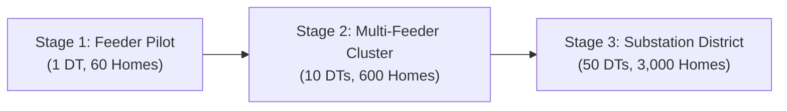

# SAANJH Indian Deployment & Scalability Pathway

**Challenge 03:** Making Clean Power Dependable  
**System:** SAANJH (Neighbourhood Flexibility Network)  
**Document:** Phased Implementation Blueprint for Indian Distribution Networks  

---

## 1. Phased Rollout Roadmap

### Stage 1: Feeder Pilot (Current Proposal / Round 2 Target)
- **Scale:** 1 Distribution Transformer (100 kVA), 60 Households, 1 Gateway.
- **Objective:** Bench-test 5 physical LoRa nodes and validate autonomous edge dispatch against local transformer CT load measurements.
- **Timeline:** 3 months.

### Stage 2: Feeder Cluster Expansion
- **Scale:** 10 Distribution Transformers across 2 adjacent 11 kV feeders (600 homes).
- **Objective:** Validate multi-gateway coordination over MQTT into utility ADMS; test diverse battery chemistries (Tubular Lead-Acid, LiFePO4).
- **Timeline:** 6 months.

### Stage 3: District Substation Integration
- **Scale:** Full 33/11 kV Substation coverage (3,000+ enrolled households).
- **Objective:** Bid aggregated dependable flexibility into Indian wholesale day-ahead/real-time markets (IEX / RTM) under state aggregator guidelines (RERC / MERC).
- **Timeline:** 12 months.

---

## 2. Practical Operational Mechanics for Urban India

1. **Technician Model:**
   - Onboarding and sensor clamp installations are performed by licensed local electricians trained in a half-day module.
   - Non-invasive split-core CTs require zero wire cutting or service interruption.
2. **Connectivity Resilience:**
   - Home-to-gateway communication relies exclusively on unlicensed 865–867 MHz LoRa RF.
   - Does NOT require household Wi-Fi or cellular SIM cards, avoiding recurring monthly data bills or disconnections.
3. **Local Fail-Safe Autonomous Operation:**
   - If internet or backhaul connectivity to the central DISCOM fails, the pole-mounted CM4 gateway operates in autonomous islanded mode, managing local transformer overload using hardcoded thermal limits and local telemetry.
4. **Consumer Protection & Blackout Reserve:**
   - Battery reserve is hard-locked at ≥70% SOC.
   - Consumers retain full emergency backup power for unplanned grid outages.
5. **Consumer Opt-Out & Consent:**
   - Participating households can opt out at any time via a physical hardware switch on the node or a simple WhatsApp/SMS bot.
   - Opted-out households are bypassed immediately with zero penalty.
6. **Utility ADMS Interface:**
   - Uses standardized IEEE 2030.5 / OpenADR 2.0b / MQTT protocols to feed aggregated capacity into Schneider EcoStruxure ADMS without modifying low-level SCADA firmware.
