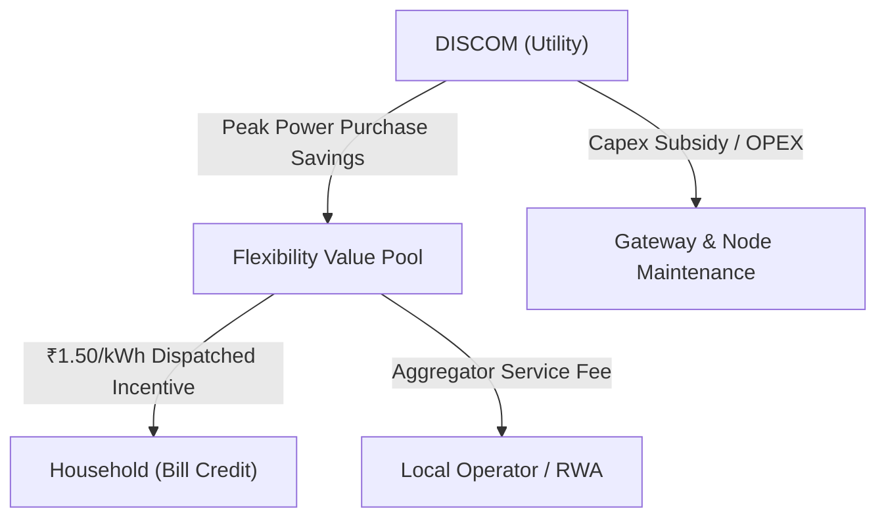

# SAANJH Ownership, Governance, & Operations Model

**Challenge 03:** Making Clean Power Dependable  
**System:** SAANJH (Neighbourhood Flexibility Network)  
**Document:** Operational & Commercial Governance Specification  

---

## 1. Asset Ownership Matrix

| Asset | Owner | Rationale | Legal / Regulatory Entity |
|---|---|---|---|
| **Inverter Batteries** | **Household** | Already purchased for domestic power backup (70% urban penetration). SAANJH does not buy batteries; it taps available capacity above a 70% emergency reserve. | Private Consumer Asset |
| **Home IoT Nodes (WisBlock LoRa)** | **DISCOM or RWA / Aggregator** | Low-cost telemetry & CT clamp hardware (₹2,999). Owned by DISCOM as grid-edge instrumentation or provided on lease. | Utility Capex or Regulated DER Incentive Scheme |
| **Edge Gateway (RPi CM4 + LoRa HAT)** | **DISCOM** | Installed on the secondary side of the distribution transformer pole/kiosk. Part of local distribution infrastructure. | DISCOM Distribution Asset |
| **SAANJH Software Stack** | **Open Architecture / Utility License** | Edge inference runs locally on the gateway; cloud supervisory management hosted within utility data center. | Enterprise Open-Source / DERMS Extension |

---

## 2. Operational Responsibility Matrix

| Function | Primary Operator | Fallback / Redundancy | Communications Requirement |
|---|---|---|---|
| **Real-Time Edge Dispatch** | **Autonomous Local Gateway (SAANJH)** | Rule-based local CT threshold fallback | Zero internet dependency (Local LoRa RF only) |
| **Day-Ahead / Evening Scheduling** | **Aggregator / RWA Operator** | Automated local XGBoost forecast | Local gateway compute |
| **Feeder Constraint Management** | **DISCOM ADMS / DMS Operator** | SAANJH Autonomous Sentinel | Upstream MQTT telemetry |
| **Consumer Opt-Out Management** | **Individual Household** | Mobile App / SMS / Physical Toggle | LoRa uplink to local gateway |

---

## 3. Maintenance & Servicing (O&M)

| Component | Maintenance Provider | Service Interval | Annual Cost Allocation |
|---|---|---|---|
| **Home Nodes & CT Clamps** | Certified Local Electrician / RWA Technician | Annual checkup / On-demand replacement | ₹300 / home-year (5% maintenance pool) |
| **Pole-Mounted Gateway** | DISCOM Line Maintenance Staff | Semi-annual visual & RF inspection | Part of standard distribution maintenance |
| **Inverter Batteries** | Household / Existing Inverter OEM | Covered by standard manufacturer warranty | Zero incremental cost to DISCOM |
| **Local RF Network (865 MHz)** | Autonomous self-healing mesh/star | Continuous heartbeat telemetry | ₹0 (Unlicensed ISM band, no SIM/data fee) |

---

## 4. Cash Flows: Who Pays Whom?

### Financial Transactions:
1. **Who Pays?**
   - **The DISCOM pays** the flexibility incentive because avoiding 1 kWh of peak spot-market power (often ₹10–₹12/kWh during summer evenings) costs far more than the ₹1.50/kWh flexibility compensation.
2. **Who Gets Paid?**
   - **The Household:** Receives a direct monthly bill credit (₹1.50 per kWh dispatched) to offset inverter battery cycle wear and reward participation.
   - **The Local Operator / RWA:** Receives an annual aggregator fee (₹6,000–₹12,000 per feeder) for managing enrollment and local technician support.
3. **Net Economics for DISCOM:**
   - Instead of deploying a ₹45,00,000 (₹45k/kW) dedicated utility battery, the DISCOM achieves 56.2 kW dependable capacity for **₹3,17,767 total investment (₹7,068/kW)**, amortized over 5 years.
